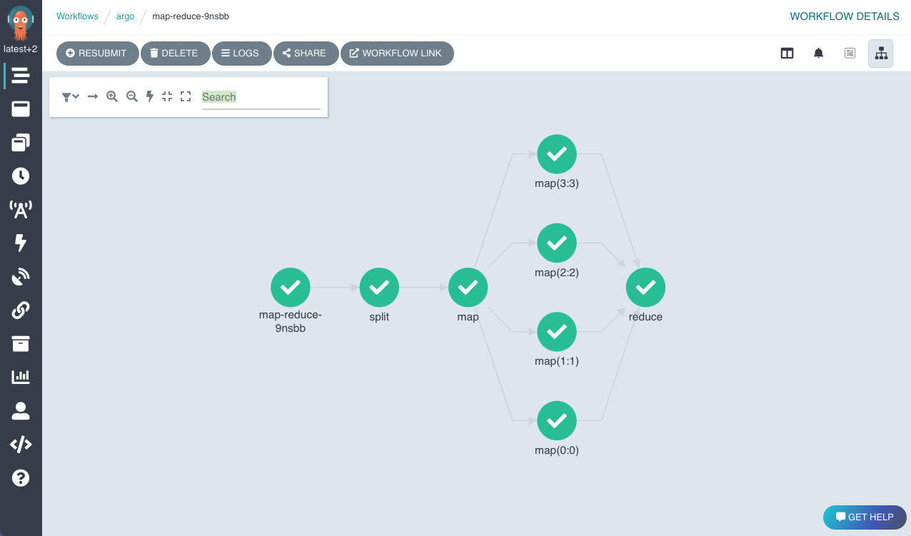
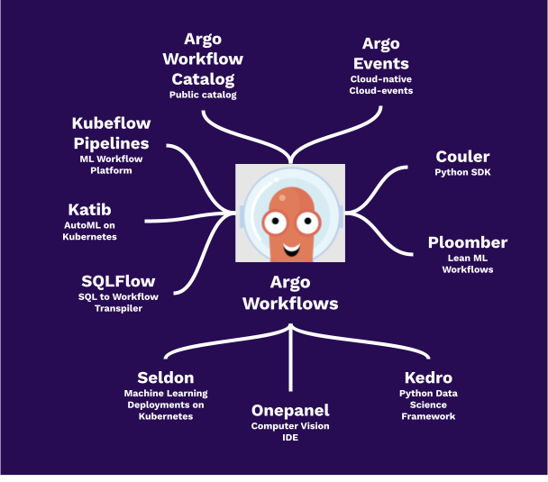

# Argo Workflows


### [View all Roadmaps](https://github.com/nholuongut/all-roadmaps) &nbsp;&middot;&nbsp; [Best Practices](https://github.com/nholuongut/all-roadmaps/blob/main/public/best-practices/) &nbsp;&middot;&nbsp; [Questions](https://www.linkedin.com/in/nholuong/)
<br/>

## What is Argo Workflows?

Argo Workflows is an open source container-native workflow engine for orchestrating parallel jobs on Kubernetes. Argo
Workflows is implemented as a Kubernetes CRD (Custom Resource Definition).

* Define workflows where each step in the workflow is a container.
* Model multi-step workflows as a sequence of tasks or capture the dependencies between tasks using a directed acyclic
  graph (DAG).
* Easily run compute intensive jobs for machine learning or data processing in a fraction of the time using Argo
  Workflows on Kubernetes.

Argo is a [Cloud Native Computing Foundation (CNCF)](https://cncf.io/) hosted project.

## Use Cases

* Machine Learning pipelines
* Data and batch processing
* ETL
* Infrastructure automation
* CI/CD

## Why Argo Workflows?

* Argo Workflows is the most popular workflow execution engine for Kubernetes.
* It can run 1000s of workflows a day, each with 1000s of concurrent tasks.
* Our users say it is lighter-weight, faster, more powerful, and easier to use
* Designed from the ground up for containers without the overhead and limitations of legacy VM and server-based
  environments.
* Cloud agnostic and can run on any Kubernetes cluster.

[Read what people said in our latest survey](https://blog.nholuongut.io/argo-workflows-2021-survey-results-d6fa890030ee)

## Try Argo Workflows

[Access the demo environment](https://workflows.apps.nholuongut.io/workflows/argo) (login using Github)



## Ecosystem



[Argo Events](https://github.com/nholuongut/argo-events)
|
[Argo Workflows Catalog](https://nholuongut-labs.github.io/argo-workflows-catalog/)
|
[Couler](https://github.com/couler-proj/couler)
|
[Katib](https://github.com/kubeflow/katib)
|
[Kedro](https://kedro.readthedocs.io/en/stable/)
|
[Kubeflow Pipelines](https://github.com/kubeflow/pipelines)
|
[Onepanel](https://www.onepanel.ai/)
|
[Ploomber](https://github.com/ploomber/ploomber)
|
[Seldon](https://github.com/SeldonIO/seldon-core)
|
[SQLFlow](https://github.com/sql-machine-learning/sqlflow)


## Client Libraries

Check out our [Java, Golang and Python clients](docs/client-libraries.md).

## Quickstart

```bash
kubectl create namespace argo
kubectl apply -n argo -f https://raw.githubusercontent.com/nholuongut/argo-workflows/master/manifests/install.yaml
```

## Who uses Argo Workflows?

[Official Argo Workflows user list](USERS.md)

## Documentation

* [Get started here](docs/quick-start.md)
* [How to write Argo Workflow specs](https://github.com/nholuongut/argo-workflows/blob/master/examples/README.md)
* [How to configure your artifact repository](docs/configure-artifact-repository.md)

## Features

* UI to visualize and manage Workflows
* Artifact support (S3, Artifactory, Alibaba Cloud OSS, HTTP, Git, GCS, raw)
* Workflow templating to store commonly used Workflows in the cluster
* Archiving Workflows after executing for later access
* Scheduled workflows using cron
* Server interface with REST API (HTTP and GRPC)
* DAG or Steps based declaration of workflows
* Step level input & outputs (artifacts/parameters)
* Loops
* Parameterization
* Conditionals
* Timeouts (step & workflow level)
* Retry (step & workflow level)
* Resubmit (memoized)
* Suspend & Resume
* Cancellation
* K8s resource orchestration
* Exit Hooks (notifications, cleanup)
* Garbage collection of completed workflow
* Scheduling (affinity/tolerations/node selectors)
* Volumes (ephemeral/existing)
* Parallelism limits
* Daemoned steps
* DinD (docker-in-docker)
* Script steps
* Event emission
* Prometheus metrics
* Multiple executors
* Multiple pod and workflow garbage collection strategies
* Automatically calculated resource usage per step
* Java/Golang/Python SDKs
* Pod Disruption Budget support
* Single-sign on (OAuth2/OIDC)
* Webhook triggering
* CLI
* Out-of-the box and custom Prometheus metrics
* Windows container support
* Embedded widgets
* Multiplex log viewer


# 🚀 I'm are always open to your feedback.  Please contact as bellow information:
### [Contact ]
* [Name: Nho Luong]
* [Skype](luongutnho_skype)
* [Github](https://github.com/nholuongut/)
* [Linkedin](https://www.linkedin.com/in/nholuong/)
* [Email Address](luongutnho@hotmail.com)
* [PayPal.me](https://www.paypal.com/paypalme/nholuongut)


[](https://ko-fi.com/nholuong)

# License
* Nho Luong (c). All Rights Reserved.🌟